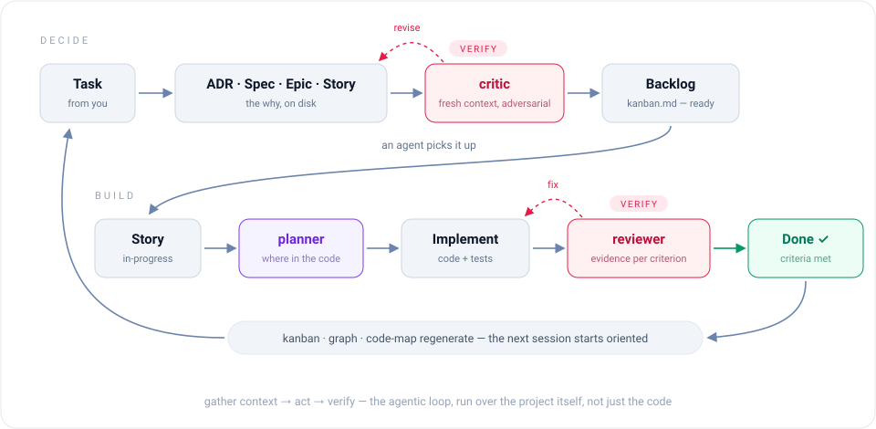
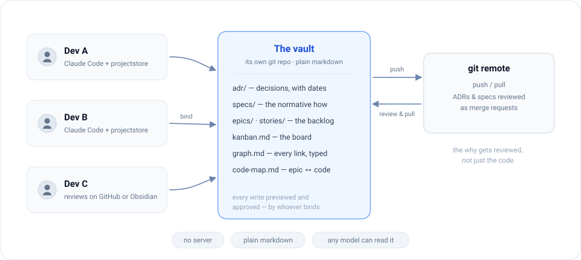

# ProjectStore

> Not a memory plugin. ProjectStore is how your AI agent runs the *project* — decisions, specs, epics, stories and a kanban board as plain markdown in git — so the next agent, the next model, or you in six months know exactly **why** everything is the way it is.

[](https://github.com/SmartAndPoint/ProjectStore/releases) [](./LICENSE) [](https://github.com/SmartAndPoint/ProjectStore/stargazers)

A [Claude Code](https://claude.com/claude-code) plugin.

---

## Two months of agents, and nobody knows why

Agents write code fast. They re-decide settled questions even faster: every fresh session arrives empty, makes its own architectural call, and commits under its own assumptions. Two months later you have noodle code — every strand reviews fine on its own, and each was written under a different theory of the project. Ask *"why is this a queue and not a cron job?"* and nobody can answer. The agent that decided is long gone.

The fix is not a smarter agent. It is a loop with verification in it.

## The loop

The thing that makes agentic coding work — the loop Claude Code's own creator keeps pointing at — is *gather context, act, verify, repeat*. ProjectStore runs that loop one level up: over the project, not just the code.

<picture>
  <source media="(prefers-color-scheme: dark)" srcset="docs/images/loop.svg">
  
</picture>

1. **You hand the agent a task.** It opens an artifact before it opens an editor: an ADR if something needs deciding, an epic and stories for the work, a spec when the "how" is non-trivial.
2. **A fresh-context critic attacks the artifact.** Expect *revise* — on this repo it has yet to pass anything on the first try, and that is the point.
3. The fixed artifact lands in the **backlog**; the kanban regenerates itself.
4. An agent picks up a story. A **planner** reads how earlier epics actually landed in the code and says where this change belongs.
5. A **reviewer** matches the diff against the story's acceptance criteria — per criterion, with evidence — before anything gets called done.
6. **Done.** Board, link graph and code map regenerate. The next session starts oriented instead of guessing.

Mechanisms hold this together, not discipline: an agent that starts coding with no story open gets nudged, artifacts are not final before review, and a deterministic `doctor` checks the mechanical consistency with zero AI involved. Every *verify* step is a separate fresh-context agent with no stake in the draft it is judging.

We build ProjectStore with ProjectStore. The feature that names your session went through exactly this loop — including a critic pass that killed the design's central claim, and a reviewer pass that caught a bug which would have shipped the feature silently dead for every real user.

## What lands on disk

Say *"let's go with Postgres, not Mongo — we need transactions"*, approve the draft, and a real file lands:

```markdown
---
title: "Use Postgres for primary storage"
status: accepted
date: 2026-07-03
---
## Context
We need ACID transactions for order processing...
## Decision
Postgres 16 as the primary store...
## Alternatives Considered
### MongoDB — rejected because...
```

Six months later, *"why Postgres?"* has an answer with a date and the alternatives you rejected. Stories work the same way — status in frontmatter, board generated from it — and your status line always shows what *this* session is working on:


Open the vault in [Obsidian](https://obsidian.md) and you get the graph view and the board for free. Don't use Obsidian? Everything renders on GitHub and in any editor.

## Install — one message

Open Claude Code in your project and say:

> Install the projectstore plugin from https://github.com/SmartAndPoint/ProjectStore and set it up for this project.

That's the whole setup. Claude adds the marketplace, installs the plugin, and walks you through binding a vault, scaffolding it and wiring the status line — every step previewed, nothing written without your Yes.

<details>
<summary>Prefer to type it yourself?</summary>

```
/plugin marketplace add SmartAndPoint/ProjectStore
/plugin install projectstore@SmartAndPoint
/reload-plugins
/projectstore:bind ~/Documents/my-project-vault
```

One switch worth flipping: Claude Code does **not** auto-update third-party plugins by default — `/plugin` → **Marketplaces** → **SmartAndPoint** → toggle **auto-update** on. If you skip it, `/projectstore:doctor` will remind you later with the exact setting.

Contributors: `git clone` this repo, then `claude --plugin-dir ./ProjectStore`.
</details>

## When an agent starts a task, it can find its way

Two generated views exist for exactly that moment. `graph.md` holds every artifact's links, typed, in both directions — one grep returns a document's whole neighborhood. `code-map.md` answers where the code for each epic actually lives, so new code lands where the old code already is. And before any architectural choice, the agent is pointed at the ADR index first — which is how settled questions stay settled.

## Teams: many humans, many agents

<picture>
  <source media="(prefers-color-scheme: dark)" srcset="docs/images/team.svg">
  
</picture>

Put the vault in its own repository. Every teammate installs ProjectStore, binds to the same vault, and contributes through the same approval gates. ADRs and specs get reviewed like code — as merge requests, except what's under review is the *reasoning*. A teammate without an agent reviews on GitHub or in Obsidian: it is all just markdown.

Parallel sessions coordinate too: each registers itself, sessions warn each other on the same vault, every status line shows only its own work — and once a session's writing settles on an epic or a document, it gets offered a name to be addressed by. Measured before shipping: roughly one offer per session; the naive "rename on every change" fired 37 times in the worst recorded session, which is why it doesn't do that.

## What it costs — measured, not promised

Running the loop is not free, and we will not pretend otherwise. On this very repository — the worst case we know, since here the tool builds itself and every change goes through the full loop — vault work measures **22.5% of total spend**. On a typical project, budget **10–15% of your weekly limit**.

What you get for it: a project manager and a systems analyst who never forget to file, made of the same agent you already pay for. The artifacts are not notes-to-self — they are the working backlog, the review record and the decision log of the project.

And they are the exit door. The vault is plain markdown in git — no server, no proprietary format, nothing to export. Move to Codex, Gemini or DeepSeek tomorrow and the project continues: the orientation a new agent needs is already on disk, so you spend no tokens re-teaching a model what the project is and why.

## Fact sheet

**20 commands** · **5 agents** — critic, planner, reviewer, librarian, archaeologist, all read-only and fresh-context · **6 languages** — en, ru, es, de, fr, zh · zero runtime dependencies

The deep dive — real session files, measured payloads, how every mechanism works and where its limits are: [docs/how-it-works.md](./docs/how-it-works.md).

## Philosophy

1. **Markdown + git is the source of truth.** No proprietary format. The plugin can disappear; your project's decisions remain.
2. **Obsidian is a view, not a dependency.** Files render on GitHub, in any editor, in `cat`.
3. **The agent is a methodologist, not a database.** Skills nudge, commands gate, humans approve.
4. **Layouts are opinionated.** v1 ships `engineering`; community adds `data-analytics`, `product`, `chatbot`, `library`.
5. **One brain per project, not per person.** The vault travels with the repo. Karpathy's [LLM Wiki](https://gist.github.com/karpathy/442a6bf555914893e9891c11519de94f) is its personal-research counterpart.

## Uninstalling

`/plugin uninstall projectstore@SmartAndPoint`. Your vault is yours — plain markdown, untouched. One leftover to remove by hand: the agents block in `CLAUDE.md`/`AGENTS.md` — delete everything between `<!-- projectstore:agents … -->` and `<!-- /projectstore:agents -->`.

## Extending

See [`docs/extending.md`](./docs/extending.md) for adding layouts, templates, and skills.

## Contributing

Issues and discussions: https://github.com/SmartAndPoint/ProjectStore/issues. PRs welcome — adding a layout is a good first contribution (see `scaffold/layouts/engineering.json` for the format).

## License

MIT — see [`LICENSE`](./LICENSE).
