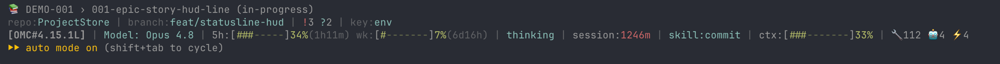

# ProjectStore

> Your project's documentation, written and maintained by your AI agent inside an **Obsidian-friendly markdown vault** — ADRs, epics, stories, runbooks, research, meetings. Same markdown-first + agent-maintained idea as Karpathy's [LLM Wiki](https://gist.github.com/karpathy/442a6bf555914893e9891c11519de94f), but for engineering project artifacts instead of personal research.

[](https://github.com/SmartAndPoint/ProjectStore/releases) [](./LICENSE) [](https://github.com/SmartAndPoint/ProjectStore/stargazers)

A Claude Code plugin.

---

## 30-second install

Inside Claude Code:

```
/plugin marketplace add SmartAndPoint/ProjectStore
/plugin install projectstore@SmartAndPoint
/reload-plugins
```

Bind the plugin to a folder — that folder becomes your project's vault:

```
/projectstore:bind ~/Documents/my-project-vault
/projectstore:scaffold engineering
```

Done. Open `~/Documents/my-project-vault` in [Obsidian](https://obsidian.md) — that's your project's brain. From here on, the agent writes ADRs, epics, stories, and runbooks into the vault as your conversation moves forward. You approve every write.

Local dev install:

```bash
git clone https://github.com/SmartAndPoint/ProjectStore.git
claude --plugin-dir ./ProjectStore
```

## Updates

Third-party marketplaces don't auto-update by default in Claude Code. After `/plugin marketplace add SmartAndPoint/ProjectStore`, open `/plugin` → **Marketplaces** tab and toggle auto-update on if you want notifications for new releases at Claude Code startup. When an update lands, Claude Code prompts you to run `/reload-plugins` to activate it.

To pin to a specific release, add the marketplace with a git ref:

```
/plugin marketplace add SmartAndPoint/ProjectStore#v0.6.0
```

Otherwise the marketplace tracks the `main` branch HEAD.

---

## What it is

Most "AI memory" plugins record what was *said*. `projectstore` records what was *decided* — and turns that into the kind of files engineering teams already write by hand: ADRs you can defend, epics with acceptance criteria, a kanban that reflects real state, runbooks for ops.

```
┌─ AI session ────────────┐    ┌─ Obsidian vault ───────────┐    ┌─ Anyone reading ┐
│  /projectstore:adr      │ →  │  adr/ADR-001-postgres.md    │ →  │  Obsidian       │
│  /projectstore:epic     │    │  epics/AUTH-001/epic.md     │    │  GitHub         │
│  /projectstore:story    │    │  epics/AUTH-001/stories/    │    │  Any editor     │
│  /projectstore:research │    │  research/oidc-libs.md      │    │  cat            │
│  /projectstore:kanban   │    │  kanban.md (Obsidian fmt)   │    │                 │
└─────────────────────────┘    └────────────────────────────┘    └─────────────────┘
        approval gate                    git-tracked                same files
```

Karpathy's [LLM Wiki](https://gist.github.com/karpathy/442a6bf555914893e9891c11519de94f) (April 2026) showed how an LLM can incrementally build and maintain a markdown second brain that you browse in Obsidian. `projectstore` applies the same idea to **engineering project documentation** — opinionated layouts (ADR / epic / story / runbook) instead of free-form research articles, and one vault per project instead of one per person.

## How an agent uses projectstore

You don't type slash commands. The agent picks them up from the conversation; you only approve the writes.

### Vignette 1 — capturing a decision

> **You**: "Let's go with Postgres, not Mongo — we need ACID transactions."

The `decision-detector` skill recognises a locked-in architectural choice and nudges the agent:

> **Agent**: "This reads like an ADR. Want me to file it as `adr/ADR-001-postgres.md`?"

You say yes. The agent calls `/projectstore:adr "Use Postgres for primary storage"`. The command renders a draft in memory, shows you the full content + target path via `AskUserQuestion`. You hit **Approve**. The file lands.

### Vignette 2 — breaking work into an epic + story

> **You**: "We need an auth system. First task is OIDC discovery + token exchange."

> **Agent**: "I'll create `epics/AUTH-001/epic.md` and `epics/AUTH-001/stories/001-oidc-discovery.md`."

After both are approved, the agent runs `/projectstore:kanban` so the board is regenerated from the new story's frontmatter. Drag-and-drop in Obsidian updates the kanban; story-frontmatter remains the source of truth.

### Vignette 3 — research + peer-review

> **You**: "Compare three OIDC libraries and pick one."

The agent does the comparison, then files findings via `/projectstore:research`. After approval, the `peer-reviewer` skill nudges:

> **Agent**: "Research artifact — want me to spawn a fresh critic to review it?"

If you say yes, `/projectstore:review research/oidc-libs.md` runs a clean-context critic against the per-kind structural checklist. The critic returns concrete improvements (no sycophancy). You decide what to apply.

## Open it in Obsidian

The vault is a plain folder of markdown files. Open it as an [Obsidian](https://obsidian.md) vault and you get:

- **Graph view** — ADRs ↔ epics ↔ stories ↔ research wire up via wiki-links in frontmatter and body. The graph of your project's structure becomes visible.
- **Kanban board** — `kanban.md` uses the [Obsidian Kanban](https://github.com/mgmeyers/obsidian-kanban) plugin format. Visual board over story frontmatter; `/projectstore:kanban` is the regenerator.
- **GitHub rendering** — the same files render natively on github.com. Reviewers don't need Obsidian.
- **One brain per project** — `projectstore` is a project-scoped cousin of Karpathy's [LLM Wiki](https://gist.github.com/karpathy/442a6bf555914893e9891c11519de94f). His pattern is *one brain per person*. Ours is *one brain per project*, and the brain travels with the repo.

## Why this matters

| You hit a wall when… | projectstore handles it because… |
|---|---|
| `/compact` wipes context mid-feature | PreCompact hook injects vault map + command list + this session's last 15 vault writes — the post-compact agent resumes without re-deriving project structure |
| Two Claude sessions on the same project race on the same artifact | Each session registers in the vault keyed by Claude's `session_id`; SessionStart warns about active siblings; create commands re-check file existence right before write |
| Six months later you forget why X was chosen | ADRs live next to the code, in markdown, with rationale and alternatives considered |
| The agent fabricates "memory" of past decisions | There is no memory — there are files. Grep them. |
| An agent silently rewrites a critical doc | Every write goes through `AskUserQuestion` with target path + content preview. You see the diff before it lands. |

## Real example — two sessions, one project

This was the actual state in our development vault while building v0.6.0. Two Claude Code instances open in the same project, each registers under its own Claude `session_id`:

```bash
$ ls .projectstore/sessions/
d9149e0d-9169-43ef-b2c6-3e005a00e133.json   # session A — plugin dev
f05e61c5-f809-46e1-aa3e-b7c3366bc723.json   # session B — feature work

$ cat .projectstore/sessions/f05e61c5-f809-46e1-aa3e-b7c3366bc723.json
{
  "id":           "f05e61c5-f809-46e1-aa3e-b7c3366bc723",
  "project_root": "/Users/me/projects/myapp",
  "started_at":   "2026-05-19T13:35:36Z",
  "recent_activity": [
    { "path": "epics/WEB-101/PROGRESS.md",                       "tool": "Read",  "at": "..." },
    { "path": "epics/WEB-101/epic.md",                           "tool": "Edit",  "at": "..." },
    { "path": "epics/WEB-101/stories/001-oidc-flow/README.md",   "tool": "Write", "at": "..." }
  ]
}
```

When session A starts up, SessionStart sees session B's mtime < 30 minutes and prepends a warning to A's context:

> ⚠️ Multi-session warning — 1 other projectstore session active on this vault. Run `/projectstore:search <topic>` before creating new artifacts; run `/projectstore:status` to see what was touched recently.

Sessions stop stepping on each other.

## Surviving /compact

When context is about to be compacted (manual `/compact` or automatic), the PreCompact hook hands off a *survival packet* — a structured snippet that lands in the post-compact agent's context — and prints a single line to your terminal so you see it ran:

```
PreCompact [...pre-compact.mjs] completed successfully: {
  "systemMessage": "projectstore: survival packet injected —
                    vault myapp-vault, layout engineering, 3 recent file(s),
                    in-flight: epics/WEB-101/epic.md"
}
```

The packet contains the vault path, the command list, the last 15 vault touches, and the newest in-flight ADR / epic / story / research. The post-compact agent picks up drafting from where the previous one left off, no manual rehydration.

## What's in the box (v0.12)

- **14 commands** — `bind`, `scaffold`, `status`, `adr`, `epic`, `story`, `kanban`, `research`, `concept`, `meeting`, `runbook`, `search`, `review`, `statusline`
- **3 passive skills** — `decision-detector`, `story-completion`, `peer-reviewer`. They suggest commands; they never write directly.
- **3 bundled agents** — `projectstore-critic`, `code-planner`, `code-reviewer`. Opus, max-effort, read-only, independent fresh-context passes. See [Bundled agents](#bundled-agents).
- **1 layout** — `engineering` (`adr/`, `epics/<id>/stories/`, `research/`, `concepts/`, `meetings/`, `ops/`, `diagrams/`)
- **9 templates** — opinionated markdown with frontmatter (English + Russian variants)
- **3 hooks** — `SessionStart` (vault map + multi-session warning), `PreToolUse` (per-session activity log), `PreCompact` (survival packet)
- **1 status line** — opt-in HUD line with the current epic & story, composed above an existing status line (e.g. oh-my-claudecode). See [Status line](#status-line).

## Philosophy

1. **Markdown + git is the source of truth.** No proprietary blob format. The plugin can disappear; your project's decisions remain.
2. **Obsidian is a view, not a dependency.** Files render on GitHub, in any editor, in `cat`.
3. **The agent is a methodologist, not a database.** Skills nudge, commands gate, humans approve.
4. **Layouts are opinionated.** v1 ships `engineering`; community adds `data-analytics`, `product`, `chatbot`, `library`.
5. **One brain per project, not per person.** The vault travels with the repo. Karpathy's [LLM Wiki](https://gist.github.com/karpathy/442a6bf555914893e9891c11519de94f) is its personal-research counterpart.

## Approval flow

Every command that writes or edits a file goes through `AskUserQuestion`:

1. The command renders a draft (in-memory, no disk write).
2. You see the target path + content preview.
3. You pick `Yes` / `Edit before saving` / `No`.
4. Only on `Yes` does the file land.
5. Folder index READMEs get a separate approval prompt.

## Peer-review channel

For high-stakes artifacts (ADR / research / epic), `/projectstore:review <path>` spawns a fresh critic agent with a per-kind structural checklist (`scaffold/checklists.json`). Fresh context = no anchoring bias to its own work. Returns concrete improvements, not "looks great!". Templates write `review_status: pending` into the frontmatter; the reviewer flips it to `reviewed` once you accept the diff.

## Bundled agents

`projectstore` ships three Opus, max-effort, **read-only** subagents. Each runs as an independent, fresh-context pass — the point is to catch self-approval bias, not to be a helpful assistant. They report findings; they never edit, stage, or commit. Invoke them via the Agent tool's `subagent_type` using the plugin-scoped name.

| Agent | When | What it does |
|---|---|---|
| `projectstore:projectstore-critic` | After authoring/revising an artifact (ADR / research / epic / story) or a design proposal, before treating it final | Adversarial critique: pre-commits to likely problems, verifies every claim against its source, rates assumptions (verified / reasonable / fragile), runs gap-analysis + pre-mortem with operator / maintainer / skeptic lenses, then self-audits. Verdict: `ship` / `revise` / `rethink`. |
| `projectstore:code-planner` | Before writing non-trivial code | Explores the actual codebase and returns *where* the change belongs, *which* existing patterns and utilities to reuse, the conventions to match, the repo-specific pitfalls to avoid, and an ordered placement plan — grounded in this repo, not generic advice. |
| `projectstore:code-reviewer` | After writing code, before committing | Pre-commit review: spec compliance first, then correctness / regressions / codebase-fit / tests — severity + confidence rated, discovery-not-filtered, self-audited. Verdict: `commit` / `fix first`. |

`/projectstore:review` uses `projectstore-critic` as its default critic. Because plugin agents resolve at the **lowest** priority, a same-named agent in `.claude/agents/` (project) or `~/.claude/agents/` (user) transparently overrides the bundled one — so your own tuned version always wins where you have one.

## Status line

See the epic and story the agent is working on this session, right in Claude Code's status line — composed **above** your existing HUD, not replacing it:



**It does not overwrite your current status-line settings.** `statusLine` is a single slot and not plugin-declarable, so projectstore ships `scripts/statusline.mjs` plus a `/projectstore:statusline on|off` command. Enabling it just flips `statusline.enabled` in `.claude/projectstore.json`; the **SessionStart hook** then wires the project's `.claude/settings.local.json` (local scope, this-project-only, conventionally git-ignored) to the current plugin version's script — re-derived on every session start, so it keeps working across plugin updates with no path to maintain by hand. Rather than clobber your HUD, the script **composes**: it re-runs whatever base `statusLine` command you already have — for example [oh-my-claudecode](https://github.com/Yeachan-Heo/oh-my-claudecode)'s HUD, read from `~/.claude/settings.json` — prints its output verbatim, and adds the `📚 <epic> › <story> (<status>)` line above it (position via `projectstore.json` → `statusline.position`, default `above`). With no base command it renders a standalone line: `<model> · <dir> · ⎇ <branch> · 📚 …`.

So in a projectstore project you keep your full [oh-my-claudecode](https://github.com/Yeachan-Heo/oh-my-claudecode) context / rate-limit / session HUD **and** gain the current epic & story on top. The epic/story is derived from this session's `recent_activity` log — it appears once you touch an epic or story, and stays transparent (base HUD only) otherwise.

```
/projectstore:statusline on      # enable (project-local); the hook wires + refreshes it
/projectstore:statusline off     # disable it
/projectstore:statusline status  # current state + the base HUD it composes over
```

## Roadmap

| Version | What ships | Status |
|---|---|---|
| **v0.12** | Status line shows full epic & story titles (from frontmatter, not the filename) | ✅ current |
| v0.11 | Status line install simplified — opt-in flag + self-healing SessionStart wiring | ✅ |
| v0.10 | Status line — current epic & story in the HUD, composes with an existing status line | ✅ |
| v0.9 | Bundled review agents (`projectstore-critic`, `code-planner`, `code-reviewer`) | ✅ |
| v0.8 | Russian (`ru`) templates | ✅ |
| v0.7 | First-run welcome (SessionStart one-shot), auto-update follow-up in `/projectstore:bind` | ✅ |
| v0.6 | Session isolation (Claude `session_id`), safer rebind, PreCompact `systemMessage` | ✅ |
| v0.5 | PreCompact survival packet | ✅ |
| v0.4 | Rename `ps` → `projectstore` for namespace clarity | ✅ |
| v0.3 | Multi-session coordination (race check + session registry) | ✅ |
| v0.2 | Peer-review channel + structural checklists | ✅ |
| v0.1 | Scaffolding + engineering layout + 12 commands + 2 skills | ✅ |
| v1 | Stabilise commands, marketplace publish, GIF demo | ⏳ next |
| v1.1 | `data-analytics` layout | |
| v2 | Process modules — sprint cycles, retros, Kanban transitions | |

## Extending

See [`docs/extending.md`](./docs/extending.md) for adding layouts, templates, and skills.

## Contributing

Issues and discussions: https://github.com/SmartAndPoint/ProjectStore/issues. PRs welcome — adding a layout is a good first contribution (see `scaffold/layouts/engineering.json` for the format).

## License

MIT — see [`LICENSE`](./LICENSE).
