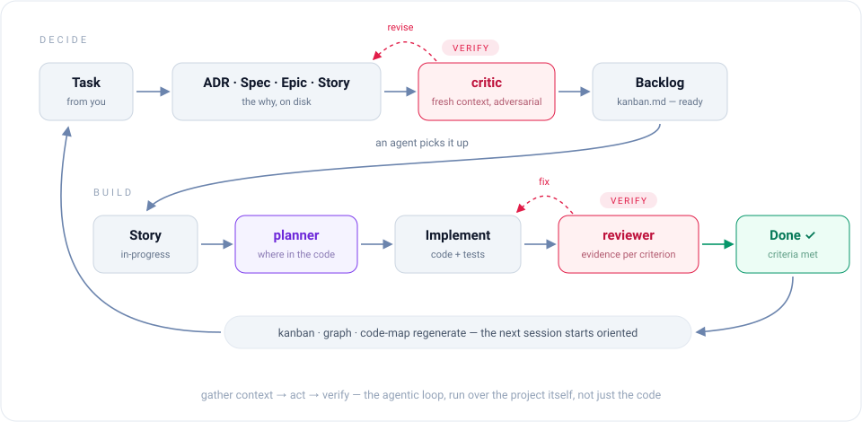
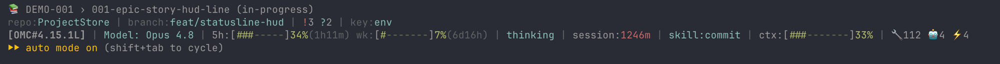
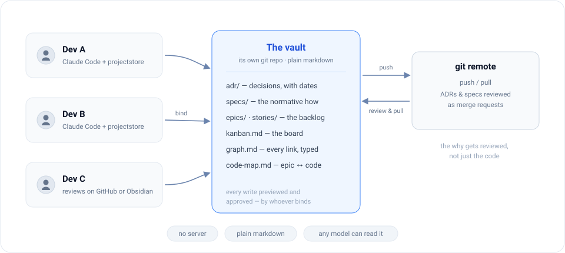

# ProjectStore

> Not agent memory, not a per-feature spec pipeline. Memory helps one agent recall; a feature spec plans one change. ProjectStore keeps the project's record — what was decided, what is in flight, what was checked — as reviewed markdown in git, readable by any agent and anyone with the repo.

[](https://github.com/SmartAndPoint/ProjectStore/releases) [](./LICENSE) [](https://github.com/SmartAndPoint/ProjectStore/stargazers)

A project workflow plugin for [Claude Code](https://claude.com/claude-code) and [OpenAI Codex](https://developers.openai.com/codex/) (experimental). Both are released together at one version, and each installs with one command.

---

## Two months of agents, and nobody knows why

Agents write code fast. They re-decide settled questions even faster: every fresh session arrives empty, makes its own architectural call, and commits under its own assumptions. Two months later you have noodle code — every strand reviews fine on its own, and each was written under a different theory of the project. Ask *"why is this a queue and not a cron job?"* and nobody can answer. The agent that decided is long gone.

The fix is not a smarter agent. It is a loop with verification in it.

## Where it fits

**Not agent memory. Not a spec pipeline. The project's record.** Three kinds of tools sit next to a coding agent. Each answers a different question.

| Kind of tool | The question it answers | What it keeps | Examples |
|---|---|---|---|
| **Agent memory** | What does this agent recall? | Notes the model keeps from its sessions, for an agent, a user or a machine. | Mem0, Zep, Codex and Claude Code memory |
| **Instruction files** | How should an agent behave here? | Standing rules for an agent, kept in the repository. | `CLAUDE.md`, `AGENTS.md`, rules, steering files |
| **Spec-driven tools** | How do we build this change? | A spec, a plan and tasks for one feature. | Spec Kit, Kiro, OpenSpec, BMAD |
| **ProjectStore** | What has the project decided, what is in flight, and was it checked? | Decisions, specs and work items with a status, a date and links, in git. A person approves each before ProjectStore writes it; a fresh-context critic reviews it by rule. | — |

Keep your agent's memory for you and your machine, and the project in the vault.

Decision logs, validators, session-start orientation and independent review each exist elsewhere. What ProjectStore adds is all of them over one linked record. Tool by tool, with sources: [`docs/alongside.md`](./docs/alongside.md).

## The loop

The thing that makes agentic coding work — the loop Claude Code's own creator keeps pointing at — is *gather context, act, verify, repeat*. ProjectStore runs that loop one level up: over the project, not just the code.

<picture>
  <source media="(prefers-color-scheme: dark)" srcset="docs/images/loop.svg">
  
</picture>

1. **You hand the agent a task.** It opens an artifact before it opens an editor: an ADR if something needs deciding, an epic and stories for the work, a spec when the "how" is non-trivial.
2. **A fresh-context critic attacks the artifact.** Expect *revise* — on this repo it has yet to pass anything on the first try, and that is the point.
3. The fixed artifact lands in the **backlog**; the kanban regenerates itself.
4. An agent picks up a story. A **planner** reads how earlier epics actually landed in the code and says where this change belongs.
5. By rule, a **reviewer** matches the diff against the story's acceptance criteria — per criterion, with evidence — before anything gets called done.
6. **Done.** Board, link graph and code map regenerate. The next session starts oriented instead of guessing.

Mechanisms hold this together, not discipline: an agent that starts coding with no story open gets nudged; an artifact that needs review carries `review_status: pending` until a critic pass is applied, so "not yet reviewed" is a state the tools can read rather than something someone must remember; and a deterministic `doctor` checks the mechanical consistency with zero AI involved. Every *verify* step is a separate fresh-context agent with no stake in the draft it is judging.

We build ProjectStore with ProjectStore. The feature that names your session went through exactly this loop — including a critic pass that killed the design's central claim, and a reviewer pass that caught a bug which would have shipped the feature silently dead for every real user.

## What lands on disk

Say *"let's go with Postgres, not Mongo — we need transactions"*, approve the draft, and a real file lands:

```markdown
---
title: "Use Postgres for primary storage"
status: accepted
date: 2026-07-03
---
## Context
We need ACID transactions for order processing...
## Decision
Postgres 16 as the primary store...
## Alternatives Considered
### MongoDB — rejected because...
```

Six months later, *"why Postgres?"* has an answer with a date and the alternatives you rejected. Stories work the same way — status in frontmatter, board generated from it — and your status line always shows what *this* session is working on:



Open the vault in [Obsidian](https://obsidian.md) and you get the graph view and the board for free. Don't use Obsidian? Everything renders on GitHub and in any editor.

## Install — one message

Open Claude Code in your project and say:

> Install the projectstore plugin from https://github.com/SmartAndPoint/ProjectStore and set it up for this project.

That's the whole setup. Claude adds the marketplace, installs the plugin, and walks you through binding a vault, scaffolding it and wiring the status line — every step previewed, nothing written without your Yes.

**On Codex**, run one command from a terminal in your project:

```
npx projectstore-codex install --project "$PWD"
```

Then restart Codex, approve the ProjectStore hooks when it asks, and run `$projectstore-bind ~/Documents/my-project-vault`. Codex support is newer and still labelled experimental: [`docs/harnesses.md`](./docs/harnesses.md#codex) says what has been verified and what has not. A project can be worked from both agents: they share the binding in `.projectstore/`, and each keeps its own overlay and session state beside it ([running both over one project](./docs/harnesses.md#running-both-over-one-project)).

<details>
<summary>Prefer to type it yourself?</summary>

```
/plugin marketplace add SmartAndPoint/ProjectStore
/plugin install projectstore@SmartAndPoint
/reload-plugins
/projectstore:bind ~/Documents/my-project-vault
```

One switch worth flipping: Claude Code does **not** auto-update third-party plugins by default — `/plugin` → **Marketplaces** → **SmartAndPoint** → toggle **auto-update** on. If you skip it, `/projectstore:doctor` will remind you later with the exact setting.

Contributors: `git clone` this repo, then `claude --plugin-dir ./ProjectStore`.

**Or from npm, in one command** — from a terminal, not inside a Claude Code session:

```
npx projectstore-claude install --project "$PWD"
```

The same tree is published to npm as [`projectstore`](https://www.npmjs.com/package/projectstore) — one source package carrying every harness's manifest — and `projectstore-claude` is its Claude Code shell: the core pinned at the same version and bundled inside, the harness fixed, so the one command has the same shape on every harness. It registers the plugin with Claude Code: it writes a small local marketplace of its own under your Claude home, then drives `claude plugin marketplace add` / `plugin install` **at local scope**, so the registration lands in this checkout's `.claude/settings.local.json` and nowhere else. It prints its plan first — every file it writes and every host command, verbatim — and at a terminal asks `Apply N changes? [Y/n]`; then it shows each step as it runs and what to do next. Without a terminal (a script, CI, an agent's tool) naming the harness is the confirmation. `plan` prints the same plan and writes nothing; `--verbose` adds every row's reasoning; `npx projectstore-claude <verb> --help` lists a verb's options with examples. Restart Claude Code afterwards. A git-marketplace copy already enabled for the checkout is silenced there (not globally) so the plugin does not load twice; `uninstall` turns it back on. Pin or upgrade with `npx projectstore-claude@<version> upgrade --project "$PWD"` — the version you name is the version you run. The core's low-level form, `npx projectstore <verb> --harness claude-code …`, is exactly what the shell runs. bun works the same on the packed bin.

**Codex has its own shell with the same one-command shape:**
`npx projectstore-codex install --project "$PWD"`. It carries a Codex
plugin manifest, namespaced workflow and role skills, lifecycle hooks, and
the exact bundled core. It stages a stable marketplace under `CODEX_HOME`,
drives `codex plugin marketplace add` and `codex plugin add`, then reads the
installation back and verifies its version and payload digest. Before it
changes anything it asks Codex for that read-back (`codex plugin list --json`),
so a Codex too old to answer stops the registration before it changes anything
and tells you to upgrade Codex. Restart Codex,
approve the hooks, and run `$projectstore-bind <vault-path>`. For later
releases, `npx projectstore-codex@<version> upgrade --project "$PWD"`. Because
Codex's plugin registry is user-global, ordinary uninstall removes only the
project's agents block; `uninstall --global` is the explicit machine-wide
removal. If `npx` answers `could not determine executable to run`, your
registry (often a company mirror) serves a stale index that knows only the
reserved `0.0.1` placeholder: name the version, and if that is not enough, the
public registry: `npx --registry https://registry.npmjs.org
projectstore-codex@<version> install --project "$PWD"` (the same holds for
`projectstore-claude`). Codex is **experimental** until a live session has exercised every
surface it installs; [`docs/harnesses.md`](./docs/harnesses.md) says what has
been measured and what has not. From a checkout, the same npx path runs against
a built tarball:

```sh
npm run shells:build -- --only projectstore-codex --dev --out dist
npx --package "./dist/projectstore-codex-$(node -p 'require("./package.json").version').tgz" projectstore-codex install --project "$PWD"
```

The package also carries a `bin`. Without a session — in CI, or in a shell — the same core answers token-free, with a `--json` envelope on every verb:

```
npx projectstore doctor --json
npx projectstore install --harness claude-code   # the low-level form the shell runs: shows the plan, asks at a terminal, then writes; without a terminal naming the harness is the confirmation — there is no --yes
npx projectstore reconcile --write --only kanban
```

Reads too — the same facts the agents get over MCP:

```
npx projectstore status --json
npx projectstore search "entry rule" --kind spec
npx projectstore show adr/README.md --section index
npx projectstore graph neighbors epics/PS-CORE/epic.md
npx projectstore codemap --for scripts/lib.mjs
```

The same eight reads are an MCP server. The plugin registers it through its own `.mcp.json`, so a Claude Code session has `status`, `search`, `get_artifact`, `neighbors`, `lineage`, `code_refs`, `orientation` and `doctor` as tools with no shell; every tool result is the CLI's `--json` for the same arguments. Elsewhere:

```
npx projectstore mcp --project "$PWD"
```

Binding, too — naming the vault is the confirmation, and changing it needs `--rebind`. `init` creates a whole vault in one step, with no `mkdir` first: the directory, its git repository, the layout's folders and their README indexes; `scaffold --write` adds the folders to a vault that was bound without them:

```
npx projectstore bind ~/vaults/my-project
npx projectstore init ~/vaults/new-project --language ru
npx projectstore scaffold --write
```

`projectstore-claude`, `projectstore-codex` and `projectstore-opencode` are this package's per-harness shells — the core pinned and bundled, the harness fixed. The Claude Code and Codex shells are published at the core's version; Codex stays labelled experimental until a live run has exercised every surface it installs ([`docs/harnesses.md`](./docs/harnesses.md)). The opencode shell publishes after its plugin root is rendered. The other `projectstore-*` names are reserved placeholders pointing back here. One source package, one version, N tarballs.
</details>

## Upgrading

`/plugin update` (or auto-update) and a restart, then one command per project
bound before 0.28. What an existing project sees afterwards, and why:

- **The project's files move to `.projectstore/`.** `.claude/projectstore.json`
  and `.claude/.projectstore/` become `.projectstore/projectstore.json`,
  `.projectstore/harness/claude-code.json` and `.projectstore/state/`. Nothing
  breaks before you move them: every reader falls back to the old paths through
  0.29, and the startup line names the command until the move is done. Close
  every Claude Code session in the project, run that command from a terminal,
  then restart. The command depends on how you installed:
  - **From the git marketplace** (every 0.27.x install): the installed copy's
    own `bin/projectstore.mjs`, with its path spelled out in the startup line —
    `node "<plugin cache>/bin/projectstore.mjs" upgrade --harness claude-code --no-register --project "$PWD"`.
    `--no-register` leaves your plugin registration as it is.
  - **From npm**: `npx projectstore-claude@<version> upgrade --no-register --project "$PWD"`.

  Both forms move only the project's files, so neither touches your plugin
  registration. The same run re-stamps the status-line launcher at its new path
  and re-registers the agents block, whose template is now v4. A plain
  `npx projectstore-claude upgrade` on a git-marketplace install does more: it
  also registers the plugin from npm for this checkout and turns the
  git-marketplace copy off here, so `/plugin update` stops reaching the
  checkout. The 0.28.0-rc.1 and rc.2 startup lines named that shell form
  (`npx projectstore-claude@<version> upgrade`, without `--no-register`), so on
  those, update first and run what the new startup line names. If it already
  happened,
  `npx projectstore-claude@<version> uninstall --surface plugin --project "$PWD"`
  (0.28.0 or later) turns the git-marketplace copy back on. That copy must be 0.28 or later — an
  older one reads a moved project as unbound — so update it first if it is not.
  Restart, then run
  `/projectstore:doctor --fix` in the new session, which re-stamps the status
  line against that copy.
- **The status line keeps rendering.** A launcher written by an earlier version
  still works, but it carries no file stamp and its embedded fallback root is
  frozen at the old version; the move above re-stamps it. Nothing rewrites that
  file behind your back any more: first wiring and refresh are `install`'s,
  behind a preview.
- **`/projectstore:status` and `/projectstore:search` answer differently:**
  facts from artifact frontmatter and the derived views' freshness instead
  of an `mtime` walk; a literal, bounded, grouped search instead of a shell
  `grep`. Every other command prints what it printed before.
- **`/projectstore:doctor` has new lines** — the state of each installed
  surface, a version-drift check across plugin versions, and one permanent
  info line saying the MCP read tools are registered. Its exit code now
  carries the verdict (1 = findings), so a red Bash result is findings, not
  a crash.
- **The plugin registers an MCP server** (eight read-only tools over the
  vault). Claude Code may ask you to approve it once.
- **The agents block stays where Claude Code reads it.** In a project with an
  `AGENTS.md`, the block goes there and `CLAUDE.md` carries a one-line
  `@AGENTS.md` import; otherwise the block goes into `CLAUDE.md`. A project with
  an `AGENTS.md` and no `CLAUDE.md` now gains that one-line `CLAUDE.md`.
- **The passive skills are published under the `projectstore-` prefix**
  (`projectstore-decision-detector`, `projectstore-peer-reviewer`,
  `projectstore-story-completion`, `projectstore-vault-communication`). Nothing
  in a project names them; only a skill listing shows the new names.
- **Rolling back** to 0.27.x before the move: everything keeps working, since
  0.27.x still reads the old layout. It rewrites the status-line launcher in its
  own form, as it always did; coming forward again, the startup line names the
  move once more, and the move re-stamps the launcher. If a session already
  re-stamped the status line or re-registered the agents block before the move
  (rc.2's `/projectstore:doctor --fix` did both), 0.27.x reports a foreign
  status line and a v4 block and leaves both alone — unless you run its
  `/projectstore:agents register`, which rewrites the block; the status line
  still renders, and the move settles both.
- **Rolling back** to 0.27.x after the move: 0.27.x looks for its binding under
  `.claude/`, finds none and offers `bind`. Do not accept. A re-bind writes
  `.claude/projectstore.json` again, and 0.28's `install` and `upgrade` refuse
  while two bindings exist. To come forward again, delete
  `.claude/projectstore.json`, then run the command the startup line names
  once more: a 0.27.x session writes its welcome marker back under `.claude/`.
- **Installed from npm?** Then `/plugin update` has nothing to fetch: the
  registration is refreshed by the package itself — from a terminal outside
  the session, `npx projectstore-claude@<version> upgrade --project "$PWD"`
  rewrites the local marketplace and runs the host's
  `plugin update` for this checkout. `/projectstore:doctor` says when the
  registration is behind the package, and names that command.

## When an agent starts a task, it can find its way

Two generated views exist for exactly that moment. `graph.md` holds every artifact's links, typed, in both directions — one grep returns a document's whole neighborhood. `code-map.md` answers where the code for each epic actually lives, so new code lands where the old code already is. And before any architectural choice, the agent is pointed at the ADR index first — which is how settled questions stay settled.

## Teams: many humans, many agents

<picture>
  <source media="(prefers-color-scheme: dark)" srcset="docs/images/team.svg">
  
</picture>

Put the vault in its own repository. Every teammate installs ProjectStore, binds to the same vault, and contributes through the same approval gates. ADRs and specs get reviewed like code — as merge requests, except what's under review is the *reasoning*. A teammate without an agent reviews on GitHub or in Obsidian: it is all just markdown.

Parallel sessions coordinate too: each registers itself, sessions warn each other on the same vault, every status line shows only its own work — and once a session's writing settles on an epic or a document, it gets offered a name to be addressed by. Measured before shipping: roughly one offer per session; the naive "rename on every change" fired 37 times in the worst recorded session, which is why it doesn't do that.

## What it costs — measured, not promised

Running the loop is not free, and we will not pretend otherwise. On this very repository — the worst case we know, since here the tool builds itself and every change goes through the full loop — vault work measures **22.5% of total spend**. On a typical project, budget **10–15% of your weekly limit**.

What you get for it: a project manager and a systems analyst who never forget to file, made of the same agent you already pay for. The artifacts are not notes-to-self — they are the working backlog, the review record and the decision log of the project.

And they are the exit door. The vault is plain markdown in git — no server, no proprietary format, nothing to export. Move to Codex, Gemini or DeepSeek tomorrow and the project continues: the orientation a new agent needs is already on disk, so you spend no tokens re-teaching a model what the project is and why.

## Fact sheet

**20 commands** · **6 agents** — critic, planner, reviewer, librarian, archaeologist (the advisors: read-only, fresh-context) and clerk (the sole write-capable one — it executes approved writes, post-gate, and composes nothing) · **6 languages** — en, ru, es, de, fr, zh · zero runtime dependencies

The deep dive — real session files, measured payloads, how every mechanism works and where its limits are: [docs/how-it-works.md](./docs/how-it-works.md).

## Philosophy

1. **Markdown + git is the source of truth.** No proprietary format. The plugin can disappear; your project's decisions remain.
2. **Obsidian is a view, not a dependency.** Files render on GitHub, in any editor, in `cat`.
3. **The agent is a methodologist, not a database.** Skills nudge, commands gate, humans approve.
4. **Layouts are opinionated.** v1 ships `engineering`; community adds `data-analytics`, `product`, `chatbot`, `library`.
5. **One brain per project, not per person.** The vault travels with the repo. Karpathy's [LLM Wiki](https://gist.github.com/karpathy/442a6bf555914893e9891c11519de94f) is its personal-research counterpart.

## Uninstalling

`/plugin uninstall projectstore@SmartAndPoint` for a Claude git-marketplace install; `npx projectstore-claude uninstall --project "$PWD"` for its npm registration. For Codex, `npx projectstore-codex uninstall --project "$PWD"` removes only project-owned wiring; add `--global` only to remove the user-global Codex plugin and marketplace. Your vault is yours — plain markdown, untouched. One leftover of a host-managed plugin path can be the agents block in `CLAUDE.md`/`AGENTS.md`; remove it with the harness's agents unregister skill, or delete everything between `<!-- projectstore:agents … -->` and `<!-- /projectstore:agents -->` by hand. `uninstall` leaves a block that lives in `AGENTS.md`, because that file is read by other coding agents too, and removes the `CLAUDE.md` import when that file holds nothing else; `uninstall --surface agents_block` removes the block as well.

## Extending

See [`docs/extending.md`](./docs/extending.md) for adding layouts, templates, and skills, and [`docs/harnesses.md`](./docs/harnesses.md) for which coding agents projectstore runs on — what "experimental" means there, and what adding one takes.

## Contributing

Issues and discussions: https://github.com/SmartAndPoint/ProjectStore/issues. PRs welcome — adding a layout is a good first contribution (see `scaffold/layouts/engineering.json` for the format).

## License

MIT — see [`LICENSE`](./LICENSE).
